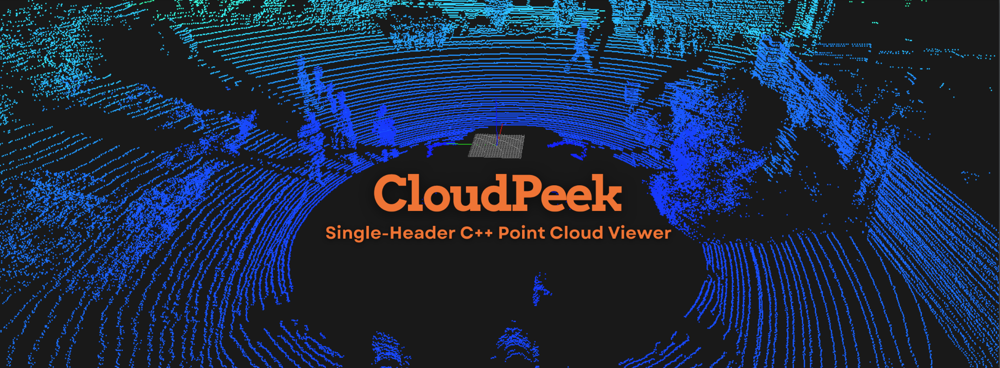

# CloudPeek



CloudPeek is a lightweight, c++ single-header, cross-platform point cloud viewer, designed for simplicity and efficiency without relying on heavy external libraries like PCL or Open3D. It provides an intuitive way to visualize and interact with 3D point cloud data across multiple platforms. Whether you're working with LiDAR scans, photogrammetry, or other 3D datasets, CloudPeek delivers a minimalistic yet powerful tool for seamless exploration and analysis—all with just a single header file.


## 📦 Features

- **High-Performance Rendering**
  - Efficiently renders large point clouds using OpenGL.
  - Supports dynamic point sizes and color mapping based on distance.

- **Comprehensive Camera Controls `Arcball Camera Model`**
  - **Zoom:** Smooth zooming in and out with adjustable speed.
  - **Pan:** Navigate the scene horizontally and vertically.
  - **Rotate:** Orbit around the target point with intuitive mouse controls.
  - **Reset View:** Quickly return to the default camera position.

- **Interactive Grid and Axes**
  - **Grid Overlay:** Aligned with the PCL coordinate system for accurate spatial reference.
  - **XYZ Axes:** Clearly labeled axes to orient your point cloud within the 3D space.

- **Color Mapping**
  - Automatically colorizes points based on their distance from the origin.
  - Supports RGB and RGBA color fields from PCD files.

- **Asynchronous Data Processing**
  - Handles point cloud data loading and processing in the background for smooth performance.

- **Flexible Input Handling**
  - Toggle between captured and free cursor modes for versatile interaction.
  - Keyboard shortcuts for camera manipulation and view resetting.

- **Supported Data Formats**
  - **PCD (Point Cloud Data):** Binary format support with fields like x, y, z, rgb, rgba [can be extended].

## 🚀 Getting Started

Follow these instructions to set up and run CloudPeek on your local machine.

### 🛠 Prerequisites

Ensure you have the following installed on your system:

- **C++ Compiler:** Compatible with C++17.
- **CMake:** Version 3.10 or higher.
- **OpenGL:** Version 3.3 Core Profile or higher.
- **GLFW:** For window and input management.
- **GLEW:** For managing OpenGL extensions (if not on macOS).
- **Other Dependencies:** Listed in `build.sh`.

### 🔧 Installation

1. **Clone the Repository**

   ```bash
   git clone https://github.com/yourusername/CloudPeek.git
   cd CloudPeek
   ```

2. **Build the Project**

> Note: Ensure build.sh has execution permissions. If not, make it executable: `$chmod +x build.sh`

3. **Run the Application**
4. 
Execute the run script with a sample PCD file.

```bash

./run.sh data/lidar_kitti_sample.pcd

```
> Note: Replace data/lidar_kitti_sample.pcd with the path to your own PCD file as needed.


# 🎮 Usage

Once the application is running smiler to this [demo](data/vid/CloudPeek_Viewer_KITTI_PCD_Demo.mp4), you can interact with the point cloud using the following controls:

## ⌨️ Keyboard Shortcuts
- **Toggle Cursor Capture**: Press `F1` to switch between captured and free cursor modes.
- **Reset View**: Press `R` to return the camera to its initial position.
- **Exit Application**: Press `ESC` to close the viewer.


## 🖱 Mouse Controls
- **Rotate Camera**: Click and drag the left mouse button to orbit around the target point.
- **Pan Camera**: Use the arrow keys or W, A, S, D to move the camera horizontally and vertically.
- **Zoom**: Scroll the mouse wheel to zoom in and out.


# 📐 Configuration

CloudPeek offers several configurable parameters to tailor the viewing experience:

## Configuration Constants
Located in `PointCloudViewer.h` under the `Config` namespace, you can adjust the following settings:

### Window Settings
- `WINDOW_WIDTH` and `WINDOW_HEIGHT`: Define the size of the application window.
- `WINDOW_TITLE`: Title displayed on the window.

### Grid Settings
- `GRID_SIZE`: Determines the half-size of the grid in meters.
- `GRID_STEP`: Sets the spacing between grid lines.

### Camera Settings
- `INITIAL_DISTANCE`: Starting distance of the camera from the target.
- `INITIAL_AZIMUTH` and `INITIAL_ELEVATION`: Initial angles for camera orientation.
- `INITIAL_FOV`: Field of view for the perspective projection.
- `CAMERA_SENSITIVITY`: Mouse sensitivity for camera rotation.
- `ZOOM_SPEED`: Speed multiplier for zooming.
- `PAN_SPEED`: Speed multiplier for panning.
- `MIN_DISTANCE` and `MAX_DISTANCE`: Limits for camera zoom distance.

### Point Rendering Settings
- `POINT_SIZE`: Size of each rendered point.

### Supported Data Fields
- `SUPPORTED_FIELDS`: List of fields that CloudPeek can interpret from PCD files (`x`, `y`, `z`, `rgb`, `rgba`).


# 📝 Contributing
Contributions are welcome! Whether you're fixing bugs, improving features, or adding new functionalities, your input is valuable.

### Steps to Contribute:

1. **Fork the Repository**
2. **Create a Feature Branch**

```bash
git checkout -b feature/YourFeature

```

3. **Commit Your Changes**

```bash
git commit -m "Add your message"

```

4. **Push to the Branch**
   
```bash
git push origin feature/YourFeature
```

5. **Open a Pull Request**
Please ensure your code adheres to the project's coding standards and includes appropriate documentation.


# 🛡 License
Distributed under the Apache License 2.0. 

# 📫 Contact
Author Geekgineer [abdalrahman.m5959@example.com](mailto:abdalrahman.m5959@gmail.com).
